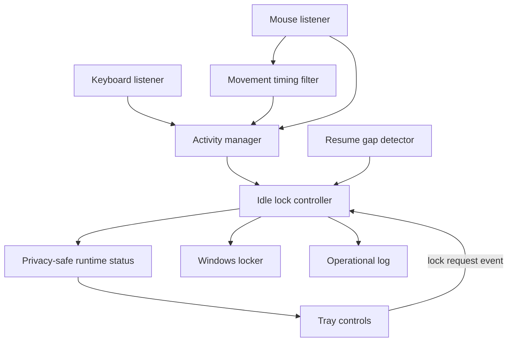

# Sentinel Lock Architecture

## Design goals

Sentinel Lock stays small, local-first, and keyboard/mouse-only:

1. **Fail safely:** failed lock requests are reported and retried.
2. **Remain lightweight:** input callbacks only update small in-memory state.
3. **Preserve privacy:** raw keyboard and mouse content is never retained.
4. **Stay testable:** clocks, monitors, runtime UI, registry access, and the locker are replaceable.
5. **Keep platform code separate:** lock decisions never call Windows APIs directly.
6. **Keep scope narrow:** only keyboard presses, meaningful mouse movement, and mouse clicks can refresh activity.

Camera, face recognition, Bluetooth proximity, trusted-device presence, microphone
sensing, and other external presence signals are not part of Sentinel Lock.

## Runtime flow

Keyboard presses and pressed mouse clicks update `ActivityManager` immediately.
Mouse movement first passes through a deterministic timing filter. The filter
confirms movement when two callbacks arrive within 250 ms and then limits
continuous movement refreshes to once every 500 ms.

`IdleLockController` calculates elapsed inactivity and requests a workstation
lock when the configured idle threshold is reached. New accepted activity
changes the activity sequence and rearms the controller for a future idle
episode.

M5 adds a runtime-experience boundary around that same controller. Tray actions
never call Windows APIs directly. **Lock now** sets a thread-safe request event
that the controller consumes on its own loop. Runtime status contains only
controller state and effective idle duration.

## Components

### Activity manager

`sentinel_lock.activity.ActivityManager` stores the latest accepted keyboard or
mouse activity timestamp and sequence number. It never stores the key value,
mouse button, or pointer coordinates.

### Input monitors

`KeyboardMonitor` converts every key press into `KEYBOARD` activity without
retaining the pressed key.

`MouseMonitor` handles movement and clicks through one `pynput` listener:

- one isolated movement callback starts a candidate burst but does not refresh activity;
- a second callback within 250 ms confirms meaningful movement;
- confirmed continuous movement can refresh activity at most once every 500 ms;
- a gap longer than 250 ms starts a new candidate burst;
- pressed clicks refresh activity immediately and reset pending movement state;
- release callbacks are ignored.

The movement filter stores only monotonic timing state. Pointer `x` and `y`
values are ignored and never retained.

### Lock controller

`sentinel_lock.idle.IdleLockController` contains the runtime policy:

- do nothing before the idle timeout;
- request one lock when the timeout is reached;
- accept a thread-safe explicit lock request from the runtime UI;
- rearm after new accepted keyboard or mouse activity;
- re-baseline effective idle time after a resume-like discontinuity;
- keep running after native-lock, resume-detector, or observer failures.

The decision rule remains deterministic. There is no presence sensor,
trusted-device bypass, external signal reader, AI model, or separate rule engine.

### Resume detector

`sentinel_lock.resume.ResumeDetector` compares consecutive local monotonic and
wall-clock samples. A sufficiently long gap is treated as suspend/resume-like
runtime discontinuity.

The controller does not fabricate an activity event on resume. Instead, it keeps
the real Activity Manager sequence unchanged and temporarily caps effective idle
time at time-since-resume until genuine keyboard or mouse activity arrives.

### Runtime UI

`sentinel_lock.runtime_ui.TrayRuntimeExperience` is an optional Windows tray
layer. It exposes:

- privacy-safe Status text;
- **Lock now**;
- **Exit**;
- local desktop notifications when supported by the tray backend.

The tray receives controller evaluations through an observer callback. Its
`RuntimeStatus` stores only controller state, effective idle seconds, and a
process-local resume count. It has no raw input access.

### Windows startup registration

`sentinel_lock.startup` manages one per-user entry in the standard Windows
`Run` registry key. Registration preserves explicitly supplied runtime CLI
options and does not require an administrator-level machine-wide key.

### Windows locker

`WindowsWorkstationLocker` is the only component that calls the Windows lock
API. `DryRunWorkstationLocker` uses the same interface without changing session
state.

### Configuration and logging

TOML configures runtime values such as idle timeout, polling, and logging.
Configuration does not introduce additional activity sources.

Logs contain lifecycle, policy, and error information only. Raw keystrokes,
mouse buttons, pointer coordinates, and private user content must not be logged.

## Scope boundary

The supported activity flow is fixed:

1. keyboard presses or mouse activity arrive through input monitors;
2. the mouse monitor filters isolated movement jitter using timing only;
3. monitors convert accepted input to minimal activity categories;
4. `ActivityManager` updates the latest activity state;
5. `IdleLockController` evaluates inactivity and explicit local lock requests;
6. runtime status observes controller output without seeing raw input;
7. `WindowsWorkstationLocker` performs the platform lock action.

Startup registration, tray controls, notifications, and resume handling do not
become new activity sources. Features that infer presence from camera, face,
Bluetooth, nearby devices, audio, location, or network state belong outside this
repository.
