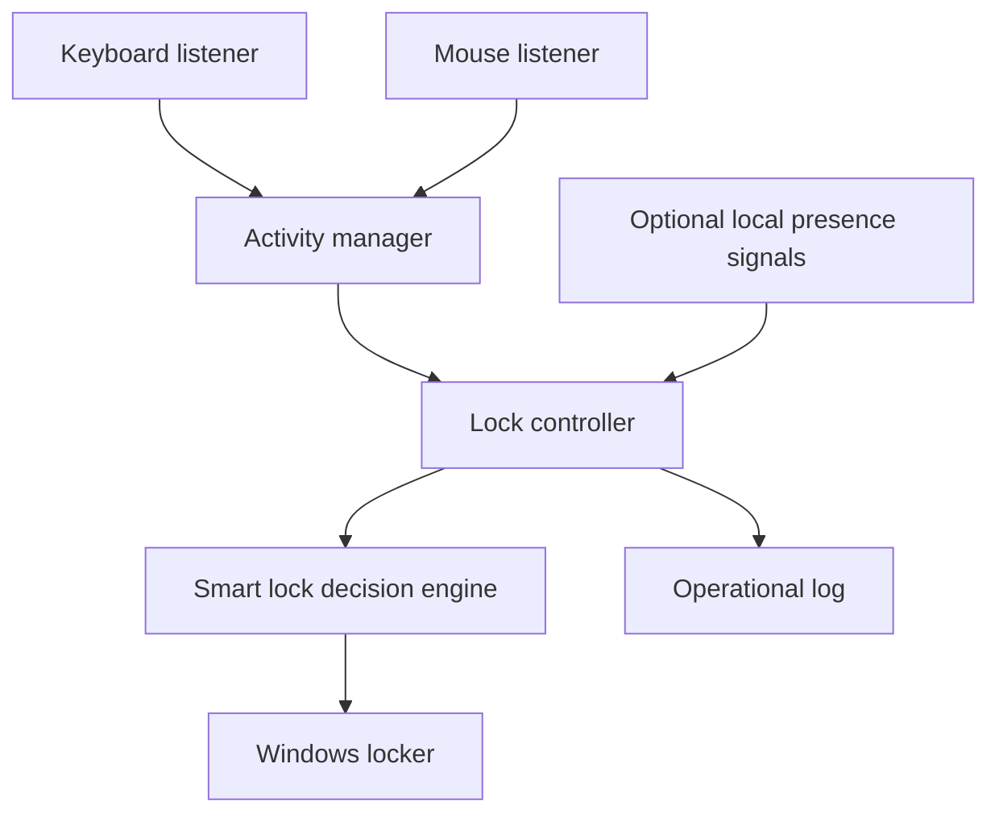

# Sentinel Lock Architecture

## Design goals

Sentinel Lock is designed around six properties:

1. **Fail safely:** a failed lock request is reported and retried; it is never
   reported as successful.
2. **Remain lightweight:** input callbacks perform one small, thread-safe state
   update and return immediately.
3. **Preserve privacy:** only the minimum state required for a lock decision is
   retained by the core application.
4. **Stay testable:** clocks, input listeners, optional signal readers, and the
   workstation locker are replaceable at component boundaries.
5. **Keep decisions separate from platform code:** policy code does not call
   Windows APIs directly.
6. **Grow through small adapters:** new presence or trusted-device sources feed
   the decision layer instead of creating separate locking paths.

## Runtime flow

Keyboard and mouse listeners publish activity categories to a shared
`ActivityManager`. The manager stores a monotonic timestamp and sequence number.
The controller calculates idle time, reads optional local presence signals, and
asks `SmartLockDecisionEngine` whether a lock should be requested.

Without an extra signal reader, the decision engine behaves exactly like the
original idle-time policy. A positive `user_present` or
`trusted_device_nearby` signal can keep an attended workstation unlocked after
the idle threshold.

## Components

### Activity manager

`sentinel_lock.activity.ActivityManager` is the source of truth for keyboard and
mouse activity. It provides immutable snapshots so consumers never read
partially updated state.

Monotonic time is used for idle calculations. This prevents wall-clock
adjustments, time-zone changes, and NTP corrections from producing incorrect
idle durations.

### Input monitors

`KeyboardMonitor` and `MouseMonitor` adapt `pynput` callbacks to activity
events. They deliberately discard the key, button, pointer location, and click
coordinates supplied by `pynput`.

### Smart lock decision engine

`sentinel_lock.decision.SmartLockDecisionEngine` is intentionally small. It
combines:

- idle time;
- optional local user-presence state;
- optional trusted-device proximity state.

Unknown optional signals do not disable the idle-lock baseline. Future computer
vision, face-recognition, Bluetooth, or trusted-device adapters should expose
simple local state to this layer instead of containing their own lock policy.

### Lock controller

`IdleLockController` remains the runtime controller for compatibility. It:

- observes activity and calculates idle time;
- reads optional supplemental signals;
- delegates the final decision to `SmartLockDecisionEngine`;
- requests at most one lock per idle episode;
- rearms after new keyboard or mouse activity;
- keeps the service alive if the platform lock call fails.

### Windows locker

`WindowsWorkstationLocker` is the only component that calls the Windows lock
API. `DryRunWorkstationLocker` provides the same interface without changing
session state.

### Configuration and logging

Configuration is loaded from TOML, validated, and converted to an immutable
`AppConfig`. TOML is only a configuration format; it is not part of lock
policy.

Logs are bounded through rotation. Raw input content, pointer coordinates,
camera frames, face images, and private user content must not be written by the
core logging path.

## Concurrency model

`pynput` invokes callbacks from listener threads. Each callback performs a
constant-time update protected by `threading.Lock`. The lock controller runs in
the foreground service thread and reads immutable state. Shutdown uses a shared
`threading.Event`, then stops and joins listeners with a bounded timeout.

Optional signal adapters should do expensive work outside input callbacks and
expose only the small state needed by the decision engine.

## Module boundaries

The supported flow is:

1. keyboard and mouse adapters update `ActivityManager`;
2. optional local adapters expose presence or trusted-device state;
3. `IdleLockController` gathers current state;
4. `SmartLockDecisionEngine` decides whether locking is appropriate;
5. `WindowsWorkstationLocker` performs the platform action.

New signal sources should plug into step 2. They must not bypass the decision
engine or call the Windows locker directly. This keeps Sentinel Lock simple
while allowing the original smart-lock direction to grow safely.
