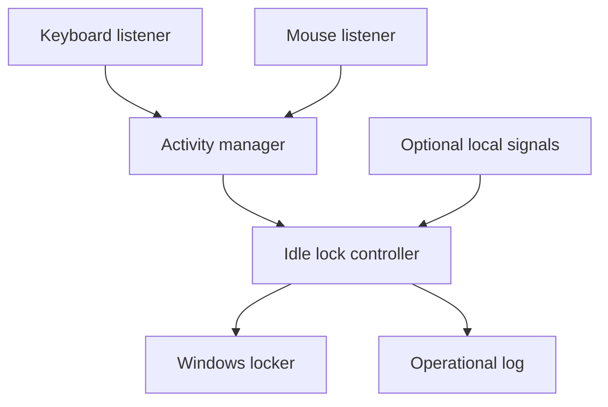

# Sentinel Lock Architecture

## Design goals

Sentinel Lock stays small and local-first:

1. **Fail safely:** failed lock requests are reported and retried.
2. **Remain lightweight:** input callbacks only update small in-memory state.
3. **Preserve privacy:** raw input content and camera data are not retained by the core.
4. **Stay testable:** clocks, monitors, optional signal readers, and the locker are replaceable.
5. **Keep platform code separate:** lock decisions never call Windows APIs directly.
6. **Add new signals through small adapters:** optional sensors provide simple state only.

## Runtime flow

Keyboard and mouse listeners update `ActivityManager`. `IdleLockController`
calculates idle time, reads optional local presence signals, applies a small
lock rule, and calls the Windows locker when locking is required.

Without an optional signal reader, behavior is ordinary idle-time locking.
`user_present=True` or `trusted_device_nearby=True` can keep an attended
workstation unlocked after the idle threshold. Unknown or failed optional
signals fall back to the idle-lock baseline.

## Components

### Activity manager

`sentinel_lock.activity.ActivityManager` stores the latest keyboard or mouse
activity timestamp and sequence number. It never stores the key value, mouse
button, or pointer coordinates.

### Input monitors

`KeyboardMonitor` and `MouseMonitor` translate `pynput` callbacks into activity
updates and discard raw event content.

### Lock controller

`sentinel_lock.idle.IdleLockController` contains the small runtime policy:

- do nothing before the idle timeout;
- keep the workstation unlocked when a connected local signal confirms presence;
- otherwise request one lock per idle episode;
- rearm after new keyboard or mouse activity;
- keep running after sensor or native lock failures.

The decision rule is a simple function in `idle.py`; there is no separate rule
engine or framework.

### Windows locker

`WindowsWorkstationLocker` is the only component that calls the Windows lock
API. `DryRunWorkstationLocker` uses the same interface without changing session
state.

### Configuration and logging

TOML is only used to configure runtime values such as idle timeout, polling, and
logging. It is not part of the lock policy.

Logs contain lifecycle, policy, and error information only. Raw keystrokes,
pointer coordinates, camera frames, face images, and private user content must
not be logged by the core application.

## Adding future signals

Future computer-vision, face-recognition, Bluetooth, or trusted-device code
should expose only simple local state such as `user_present` or
`trusted_device_nearby`.

A signal adapter must not call the Windows locker directly. The flow remains:

1. collect local signal;
2. return minimal state;
3. let `IdleLockController` make the lock decision;
4. let the Windows locker perform the platform action.

This keeps the original adaptive-lock direction without making the codebase
complex.
