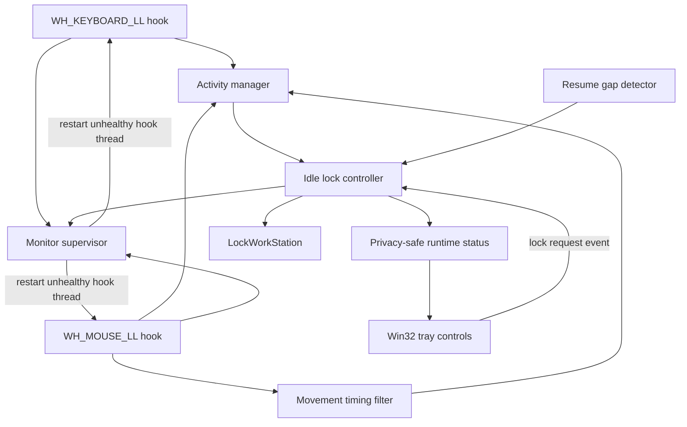

# Sentinel Lock Architecture

## Design goals

Sentinel Lock stays small, local-first, keyboard/mouse-only, and dependency-free:

1. **Fail safely:** failed lock requests are reported and retried.
2. **Remain lightweight:** input callbacks update only minimal state.
3. **Preserve privacy:** raw keyboard and mouse payloads are not retained.
4. **Stay testable:** policy code remains replaceable with deterministic fakes.
5. **Use native boundaries explicitly:** Windows-specific behavior lives behind small adapters.
6. **Use no pip runtime dependencies:** Python stdlib + Windows system APIs only.

## Runtime flow

## Scratch Win32 input layer

`sentinel_lock.win32_input` implements low-level input hooks directly with
`ctypes`:

- `SetWindowsHookExW(WH_KEYBOARD_LL, ...)`;
- `SetWindowsHookExW(WH_MOUSE_LL, ...)`;
- `GetMessageW` message loops on dedicated daemon threads;
- `CallNextHookEx` so Sentinel Lock does not swallow input;
- `UnhookWindowsHookEx` during cleanup;
- `PostThreadMessageW(WM_QUIT, ...)` for controlled shutdown.

The keyboard callback does not dereference `KBDLLHOOKSTRUCT`; it only recognizes
key-down message occurrence. The mouse callback does not dereference
`MSLLHOOKSTRUCT`; pointer coordinates and button identity therefore never enter
the application.

`KeyboardMonitor` converts a native key-down occurrence into `KEYBOARD` activity.
`MouseMonitor` passes movement occurrences through the deterministic timing filter
and maps button-down occurrence to `MOUSE_CLICK`.

## Mouse movement filter

The filter is independent of the Windows hook adapter:

- one isolated movement callback starts a candidate burst;
- a second callback within 250 ms confirms meaningful movement;
- continuous movement refreshes at most once every 500 ms;
- a gap longer than 250 ms starts a new candidate;
- a pressed click resets pending movement state.

Only monotonic timing values are retained by this filter.

## Activity manager

`ActivityManager` stores only:

- last accepted activity monotonic timestamp;
- wall-clock observation timestamp;
- activity category;
- monotonic sequence number.

It stores no key value, mouse button, or pointer coordinates.

## Monitor supervisor

Built-in monitors expose `is_alive()` and `restart()`. `MonitorSupervisor` checks
hook-thread health during the normal controller maintenance cycle. A stopped hook
is restarted; transient restart errors are logged and retried on a later poll.
Recovery cannot fabricate activity or change lock thresholds.

## Lock controller

`IdleLockController`:

- evaluates inactivity;
- requests one lock per idle episode;
- accepts a thread-safe explicit local lock request;
- rearms after real accepted activity;
- safely re-baselines after a resume-like discontinuity;
- isolates monitor-maintenance, observer, and native lock failures.

The lock decision is deterministic. There is no AI model, presence sensor,
trusted-device bypass, or external service.

## Native workstation lock

`WindowsWorkstationLocker` loads `user32.dll` with `ctypes.WinDLL` and calls
`LockWorkStation`. This is a direct Win32 API integration, not a raw NT syscall.

## Scratch tray and notifications

`sentinel_lock.win32_tray.Win32TrayBackend` uses only native Win32/Shell APIs:

- registers a hidden window class;
- owns a Win32 message loop;
- creates the notification-area icon with `Shell_NotifyIconW`;
- creates a native popup menu with Status, Lock now, and Exit;
- uses notification-area balloon information for local notifications.

`TrayRuntimeExperience` remains a policy-neutral wrapper. Tray actions never call
`LockWorkStation` directly; Lock now sets a request that the controller consumes.

## Startup registration

`sentinel_lock.startup` uses Python stdlib `winreg` and the current user's
`HKEY_CURRENT_USER\\Software\\Microsoft\\Windows\\CurrentVersion\\Run` key.
No machine-wide service or administrator-level startup entry is created.

A source checkout starts through repository-owned `run_sentinel_lock.py`. A
stdlib `.pyz` release starts through the current Python executable and the `.pyz`
path. No installed package is assumed.

## Resume detection

`ResumeDetector` compares monotonic and wall-clock progress. A sufficiently large
discontinuity is treated as a resume-like gap. It does not fabricate keyboard or
mouse activity; the controller temporarily caps effective idle time at
post-resume elapsed time until genuine input occurs.

## Reliability and performance guards

CI regression tests cover:

- 10,000 keyboard callbacks;
- 10,000 high-rate mouse movement callbacks;
- bounded process CPU and traced Python memory;
- 1,000 idle episodes with exactly one lock each;
- transient listener failure/recovery;
- repeated explicit-lock duplicate protection;
- controller wait behavior to prevent busy spinning.

## Dependency boundary

Application/runtime source may import only Python standard-library modules and
other `sentinel_lock` modules. `tests/check_stdlib_only.py` enforces this boundary
in CI. The repository has no `requirements.txt` or setuptools packaging manifest,
and normal CI/release workflows perform no `pip install` step.

The release artifact is produced by stdlib `zipapp`; it requires Python 3.11+ on
the target Windows system.

## Scope boundary

The supported activity flow remains:

1. native Windows keyboard/mouse occurrence hook;
2. privacy-preserving monitor adapter;
3. movement timing filter where applicable;
4. minimal Activity Manager state;
5. deterministic idle controller;
6. native Windows lock action.

Camera, face, Bluetooth, nearby-device, audio, location, network-presence, and
hosted AI signals remain outside this repository.
