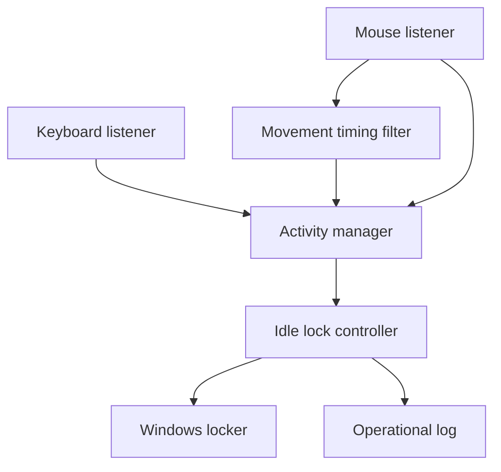

# Sentinel Lock Architecture

## Design goals

Sentinel Lock stays small, local-first, and keyboard/mouse-only:

1. **Fail safely:** failed lock requests are reported and retried.
2. **Remain lightweight:** input callbacks only update small in-memory state.
3. **Preserve privacy:** raw keyboard and mouse content is never retained.
4. **Stay testable:** clocks, monitors, and the locker are replaceable.
5. **Keep platform code separate:** lock decisions never call Windows APIs directly.
6. **Keep scope narrow:** only keyboard presses, meaningful mouse movement, and mouse clicks can refresh activity.

Camera, face recognition, Bluetooth proximity, trusted-device presence, microphone
sensing, and other external presence signals are not part of Sentinel Lock.

## Runtime flow

Keyboard presses and pressed mouse clicks update `ActivityManager` immediately.
Mouse movement first passes through a deterministic timing filter. The filter
confirms movement when two callbacks arrive within 250 ms and then limits
continuous movement refreshes to once every 500 ms.

`IdleLockController` calculates elapsed inactivity and requests a workstation
lock when the configured idle threshold is reached. New accepted activity
changes the activity sequence and rearms the controller for a future idle
episode.

## Components

### Activity manager

`sentinel_lock.activity.ActivityManager` stores the latest accepted keyboard or
mouse activity timestamp and sequence number. It never stores the key value,
mouse button, or pointer coordinates.

### Input monitors

`KeyboardMonitor` converts every key press into `KEYBOARD` activity without
retaining the pressed key.

`MouseMonitor` handles movement and clicks through one `pynput` listener:

- one isolated movement callback starts a candidate burst but does not refresh activity;
- a second callback within 250 ms confirms meaningful movement;
- confirmed continuous movement can refresh activity at most once every 500 ms;
- a gap longer than 250 ms starts a new candidate burst;
- pressed clicks refresh activity immediately and reset pending movement state;
- release callbacks are ignored.

The movement filter stores only monotonic timing state. Pointer `x` and `y`
values are ignored and never retained. This avoids using spatial pointer history
just to reject one-off jitter.

### Lock controller

`sentinel_lock.idle.IdleLockController` contains the runtime policy:

- do nothing before the idle timeout;
- request one lock when the timeout is reached;
- rearm after new accepted keyboard or mouse activity;
- keep running after a native lock failure.

The decision rule is deliberately deterministic. There is no presence sensor,
trusted-device bypass, external signal reader, AI model, or separate rule engine.

### Windows locker

`WindowsWorkstationLocker` is the only component that calls the Windows lock
API. `DryRunWorkstationLocker` uses the same interface without changing session
state.

### Configuration and logging

TOML configures runtime values such as idle timeout, polling, and logging.
Configuration does not introduce additional activity sources.

Logs contain lifecycle, policy, and error information only. Raw keystrokes,
mouse buttons, pointer coordinates, and private user content must not be logged.

## Scope boundary

The supported activity flow is fixed:

1. keyboard presses or mouse activity arrive through input monitors;
2. the mouse monitor filters isolated movement jitter using timing only;
3. monitors convert accepted input to minimal activity categories;
4. `ActivityManager` updates the latest activity state;
5. `IdleLockController` evaluates inactivity;
6. `WindowsWorkstationLocker` performs the platform lock action.

New features must preserve this boundary. Features that infer presence from
camera, face, Bluetooth, nearby devices, audio, location, or network state belong
outside this repository.
