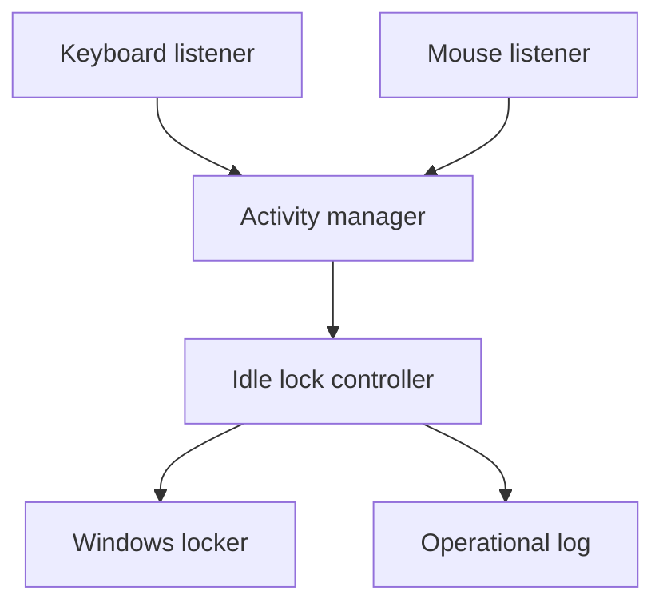

# Sentinel Lock Architecture

## Design goals

Sentinel Lock stays small, local-first, and keyboard/mouse-only:

1. **Fail safely:** failed lock requests are reported and retried.
2. **Remain lightweight:** input callbacks only update small in-memory state.
3. **Preserve privacy:** raw keyboard and mouse content is never retained.
4. **Stay testable:** clocks, monitors, and the locker are replaceable.
5. **Keep platform code separate:** lock decisions never call Windows APIs directly.
6. **Keep scope narrow:** only keyboard presses, mouse movement, and mouse clicks can refresh activity.

Camera, face recognition, Bluetooth proximity, trusted-device presence, microphone
sensing, and other external presence signals are not part of Sentinel Lock.

## Runtime flow

Keyboard and mouse listeners update `ActivityManager`. `IdleLockController`
calculates elapsed inactivity and requests a workstation lock when the configured
idle threshold is reached.

New keyboard or mouse activity changes the activity sequence and rearms the
controller for a future idle episode.

## Components

### Activity manager

`sentinel_lock.activity.ActivityManager` stores the latest keyboard or mouse
activity timestamp and sequence number. It never stores the key value, mouse
button, or pointer coordinates.

### Input monitors

`KeyboardMonitor` and `MouseMonitor` translate `pynput` callbacks into activity
updates and discard raw event content.

M4 may add deterministic filtering so tiny accidental pointer jitter does not
count as meaningful activity. That filtering must remain inside the keyboard/
mouse activity boundary and must not create user profiling or input history.

### Lock controller

`sentinel_lock.idle.IdleLockController` contains the runtime policy:

- do nothing before the idle timeout;
- request one lock when the timeout is reached;
- rearm after new keyboard or mouse activity;
- keep running after a native lock failure.

The decision rule is deliberately deterministic. There is no presence sensor,
trusted-device bypass, external signal reader, AI model, or separate rule engine.

### Windows locker

`WindowsWorkstationLocker` is the only component that calls the Windows lock
API. `DryRunWorkstationLocker` uses the same interface without changing session
state.

### Configuration and logging

TOML configures runtime values such as idle timeout, polling, and logging.
Configuration does not introduce additional activity sources.

Logs contain lifecycle, policy, and error information only. Raw keystrokes,
mouse buttons, pointer coordinates, and private user content must not be logged.

## Scope boundary

The supported activity flow is fixed:

1. keyboard presses or mouse activity arrive through input monitors;
2. monitors convert them to minimal activity categories;
3. `ActivityManager` updates the latest activity state;
4. `IdleLockController` evaluates inactivity;
5. `WindowsWorkstationLocker` performs the platform lock action.

New features must preserve this boundary. Features that infer presence from
camera, face, Bluetooth, nearby devices, audio, location, or network state belong
outside this repository.
