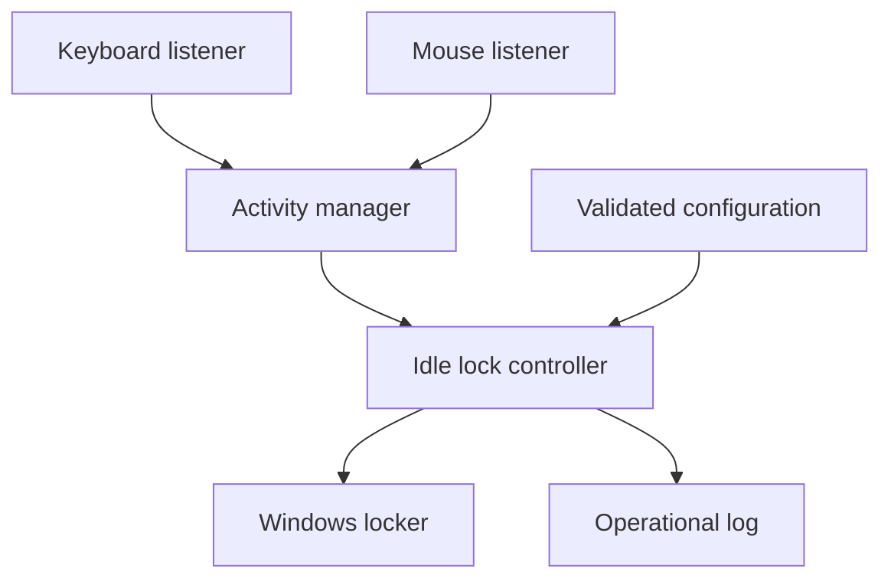

# Sentinel Lock Architecture

## Design goals

Sentinel Lock is designed around five properties:

1. **Fail safely:** a failed lock request is reported and retried; it is never
   reported as successful.
2. **Remain lightweight:** input callbacks perform one small, thread-safe state
   update and return immediately.
3. **Preserve privacy:** only event category and timing state are retained.
4. **Stay testable:** clocks, input listeners, and the workstation locker are
   replaceable at component boundaries.
5. **Keep policy separate from platform code:** idle decisions do not depend on
   Windows API or `pynput` details.

## Runtime flow

The keyboard and mouse listeners publish activity categories to a shared
`ActivityManager`. The manager stores a monotonic timestamp and an incrementing
sequence number behind a lock. `IdleLockController` polls that state at a
bounded interval and calls `WindowsWorkstationLocker` once per idle episode.

New activity changes the sequence number and rearms the controller for a future
idle episode.

## Components

### Activity manager

`sentinel_lock.activity.ActivityManager` is the single source of truth for the
latest user activity. It provides immutable snapshots so consumers never read
partially updated state.

Monotonic time is used for idle calculations. This prevents wall-clock
adjustments, time-zone changes, and NTP corrections from producing incorrect
idle durations.

### Input monitors

`KeyboardMonitor` and `MouseMonitor` adapt `pynput` callbacks to activity
events. The mouse adapter shares one OS listener for both movement and click
events to avoid duplicate hooks.

The adapters deliberately discard the key, button, pointer location, and click
coordinates supplied by `pynput`.

### Idle lock controller

`IdleLockController` contains the decision policy:

- active while `idle_seconds < idle_timeout_seconds`;
- request one lock when the threshold is reached;
- do not request another lock until new activity is observed;
- keep the service alive if the platform lock call fails.

The controller accepts a fake clock and a fake locker in tests.

### Windows locker

`WindowsWorkstationLocker` is the only component that calls a Windows API. It
invokes `user32!LockWorkStation` through Python's standard `ctypes` module and
checks the native return value.

`DryRunWorkstationLocker` provides the same interface without changing session
state.

### Configuration and logging

Configuration is loaded from TOML, type-checked, range-checked, and converted to
an immutable `AppConfig`.

Logs are bounded through rotation. They contain lifecycle, policy, and error
events only; input content and pointer coordinates are prohibited.

## Concurrency model

`pynput` invokes callbacks from listener threads. Each callback performs a
constant-time update protected by `threading.Lock`. The idle controller runs in
the foreground service thread and reads an immutable snapshot. Shutdown uses a
shared `threading.Event`, then stops and joins listeners with a bounded timeout.

No callback performs file I/O, Windows locking, configuration parsing, or
network activity.

## Extension points

Future presence or trusted-device providers should publish a separate
privacy-preserving signal to a decision engine. They must not write directly to
the activity manager or bypass the workstation locker. This keeps input
activity, presence confidence, policy, and platform actions independently
testable.
