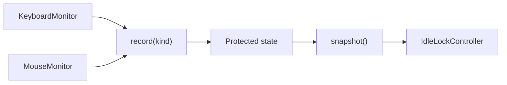

# Activity Manager Module

## Module

```text
src/sentinel_lock/activity.py
```

The Activity Manager is the central in-memory state module for keyboard and
mouse activity. It converts activity notifications into one thread-safe,
minimal state that the idle controller can read consistently.

## Responsibilities

The module:

- defines the supported activity categories;
- records the latest activity timestamp;
- stores the latest activity category;
- increments a sequence number for every accepted activity event;
- returns immutable activity snapshots;
- calculates non-negative idle duration;
- serializes concurrent keyboard and mouse updates.

The module does not:

- attach keyboard or mouse listeners;
- receive or store key values;
- receive or store mouse buttons or pointer coordinates;
- decide whether the workstation should lock;
- call Windows APIs;
- read configuration files;
- write logs or files;
- perform network operations.

## Public types

### `ActivityKind`

`ActivityKind` is a string-backed enumeration containing every activity source
accepted by the module.

| Value | Producer |
| --- | --- |
| `KEYBOARD` | `KeyboardMonitor` after a key press |
| `MOUSE_MOVE` | `MouseMonitor` after pointer movement |
| `MOUSE_CLICK` | `MouseMonitor` after a pressed-click callback |

Raw input data is discarded by the monitor before `ActivityManager.record()` is
called. The manager receives only an `ActivityKind`.

### `ActivitySnapshot`

`ActivitySnapshot` is an immutable view of activity state.

| Field | Meaning |
| --- | --- |
| `last_activity_monotonic` | Monotonic timestamp of the latest accepted event |
| `last_activity_at` | UTC wall-clock time at which the event was observed |
| `last_kind` | Latest activity category, or `None` before the first event |
| `sequence` | Number of accepted events since manager creation |

`idle_seconds(now_monotonic)` returns the elapsed duration since the snapshot's
latest activity. The returned value is never negative.

### `ActivityManager`

`ActivityManager` owns the current activity state.

| Method | Behaviour |
| --- | --- |
| `record(kind)` | Validates and records one activity category |
| `snapshot()` | Returns a consistent immutable state copy |
| `idle_seconds()` | Returns current idle duration |

## Module interactions

| Interacting module | Direction | Interaction |
| --- | --- | --- |
| `monitors/keyboard.py` | Input | Calls `record(ActivityKind.KEYBOARD)` |
| `monitors/mouse.py` | Input | Calls `record(MOUSE_MOVE)` or `record(MOUSE_CLICK)` |
| `idle.py` | Output | Reads snapshots to evaluate the idle timeout |
| `app.py` | Construction | Creates the shared manager and passes it to consumers |
| `tests/test_activity.py` | Verification | Tests state, timing, validation, and concurrency |

The Activity Manager does not interact directly with `config.py`, `cli.py`,
`locker.py`, or `logging_setup.py`.

## Event flow



For each event:

1. a keyboard or mouse callback selects an `ActivityKind`;
2. `record()` verifies that the value is an `ActivityKind`;
3. the manager acquires its state lock;
4. monotonic and wall-clock timestamps are captured;
5. the latest category and timestamps are replaced;
6. the sequence number is incremented;
7. an immutable snapshot is returned;
8. the lock is released.

## Time model

Idle duration uses `time.monotonic()`, not the system wall clock. Monotonic time
is appropriate for elapsed durations because manual clock changes, time-zone
changes, and clock synchronization do not move it backwards.

The wall-clock timestamp exists only as descriptive in-memory state. It is not
used for idle policy.

Both clocks can be injected during tests:

```python
manager = ActivityManager(
    clock=fake_monotonic_clock,
    wall_clock=fake_wall_clock,
)
```

## Concurrency model

Keyboard and mouse callbacks may execute on different listener threads.
`ActivityManager` protects every read and write of shared state with one
`threading.Lock`.

The following invariants must always hold:

- each accepted event increments `sequence` exactly once;
- snapshots never expose partially updated state;
- `last_activity_monotonic` never moves backwards;
- calculated idle duration is never negative;
- callers cannot mutate a returned snapshot.

Callbacks must not hold or access the manager's internal lock directly.

## Validation and failure behaviour

`record()` accepts only an `ActivityKind`. Passing a raw string or another
object raises `TypeError` and leaves the state unchanged.

Clock failures are allowed to propagate to the calling monitor. Input monitors
catch unexpected callback errors, log the operational failure, and keep raw
input information out of the error message.

## Privacy boundary

The module is intentionally unable to reconstruct user input. Its stored state
contains only:

- one activity category;
- two timestamps;
- one event sequence counter.

Adding key text, button identity, pointer coordinates, application names, or
input history to this module is outside the project scope.

## Test coverage

`tests/test_activity.py` verifies:

- initial state before any event;
- timestamp, category, and sequence updates;
- non-negative idle duration;
- rejection of untyped activity categories;
- correct sequence totals under concurrent updates.

Tests use fake clocks and never attach real input listeners.
